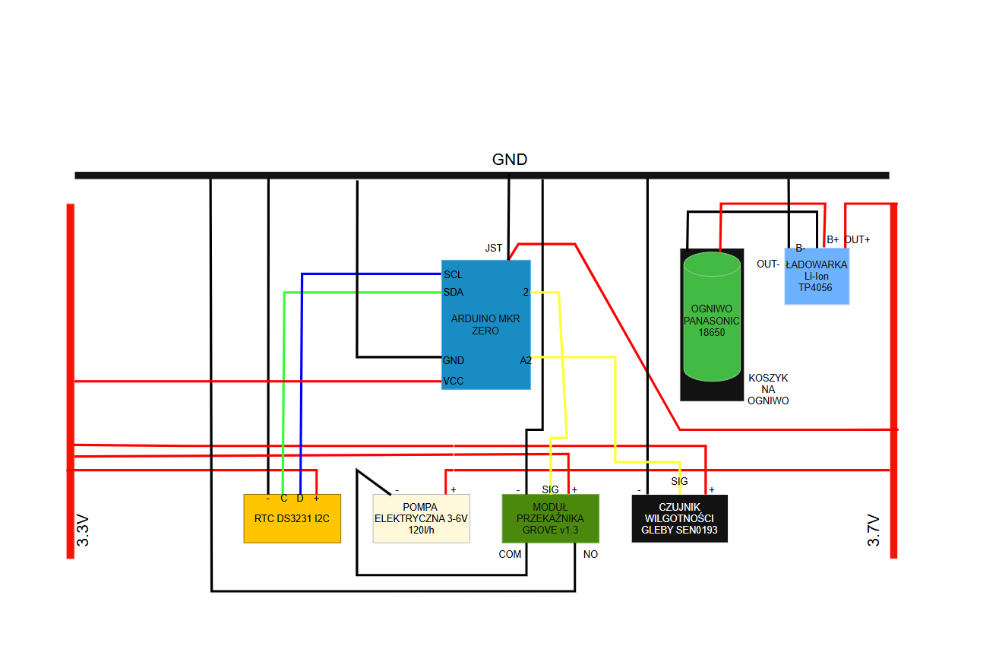

# 🌱 Autonomiczna Doniczka

Automatyczny system podlewania roślin oparty na Arduino MKR Zero. Urządzenie mierzy wilgotność gleby o zaplanowanej godzinie i w razie potrzeby uruchamia pompę wodną. Dane z odczytu wilgotności są logowane na kartę SD.

---

## 📦 Lista komponentów

| Komponent | Model | Opis |
|---|---|---|
| Mikrokontroler | [Arduino MKR Zero](https://botland.com.pl/arduino-mkr-oryginalne-plytki/10051-arduino-mkr-zero-abx00012-samd21-ze-zlaczami-7630049200470.html) | Główny kontroler systemu |
| Zegar czasu rzeczywistego | [DS3231](https://botland.com.pl/moduly-rtc/3790-modul-rtc-ds3231-i2c-zegar-czasu-rzeczywistego-5904422373788.html) | Precyzyjny zegar RTC z interfejsem I2C |
| Czujnik wilgotności gleby | [DFRobot Gravity SEN0193](https://botland.com.pl/gravity-czujniki-pogodowe/10305-dfrobot-gravity-analogowy-czujnik-wilgotnosci-gleby-odporny-na-korozje-sen0193-6959420910434.html) | Analogowy, odporny na korozję |
| Przekaźnik | [Grove Relay v1.3](https://botland.com.pl/grove-przekazniki/11347-grove-modul-przekaznika-v13-5904422317492.html) | Sterowanie pompą niskim napięciem |
| Pompka wodna | [Pompka](https://elektroweb.pl/pl/pompki/128-pompka-wody-pompa-wodna-120lh-arduino.html?gad_source=1&gad_campaignid=22555279180&gbraid=0AAAAADsUy2a1NzOEVEErmPQi2ZGFPdWga&gclid=CjwKCAjw-dfOBhAjEiwAq0RwIxg1ERbMOm2Mi6RL3Lvrf4u5HGKSHjVERzu0v-OiEWt8Td3nkfpXzhoClnkQAvD_BwE) | Pompka DC 3-6V |
| Ogniwo | [Panasonic NCR18650B 3400mAh](https://botland.com.pl/akumulatory-li-ion/5658-ogniwo-18650-li-ion-panasonic-ncr-18650b-3400mah-5903205772107.html) | Ogniwo Li-Ion 18650 |
| BMS z ładowarką | [Ładowarka TP4056](https://botland.com.pl/ladowarki-elektryczne/16979-ladowarka-li-ion-hw-373-v121-tp4056-pojedyncza-cela-1s-37v-usb-typ-c-z-zabezpieczeniami-5904422326708.html) | Zarządzanie i ładowanie ogniwa |
| Karta microSD | [Karta microCD 32GB](https://www.euro.com.pl/karty-pamieci/goodram-microsdhc-class-10-32gb_1.bhtml?utm_source=google&utm_medium=cpc&utm_campaign=it_pla&gclsrc=aw.ds&gad_source=1&gad_campaignid=22662403337&gbraid=0AAAAAD6k90Fu2iBpt2Qm1Jxqn-Rn65-f-&gclid=CjwKCAjw-dfOBhAjEiwAq0RwIwgZnJMcPC_8r6eZRisEWKXUDxba7TdW2TWGpc1vj9JLIaEWVWQKaRoCIRoQAvD_BwE) | Logowanie danych pomiarowych |
| Złącze JST | [JST PH 2-pin, raster 2mm](https://botland.com.pl/przewody-i-zlacza-zasilajace/6563-wtyk-jst-prosty-2-pinowy-raster-20mm-z-przewodem-5904422334789.html) | Podłączenie ogniwa do Arduino |
| Złączki | [WAGO 221](https://www.leroymerlin.pl/produkty/zlacze-automatyczne-szybkozlaczka-5x0-2-4-mm-5-szt-wago-88899421.html?utm_source=google&utm_medium=cpc&utm_channel=performance&channel_details=pmax&utm_campaign=pmax_rotator_dobre_bigshopper_perfo_sem&utm_marketing_tactic=paid_perfo&gclsrc=aw.ds&gad_source=1&gad_campaignid=21857552608&gbraid=0AAAAADoJ9CVjpdlEOlc8boGO7qpvOSLZs&gclid=CjwKCAjw-dfOBhAjEiwAq0RwIxGB-ScE4HlgqHeFJvUTebZp9lITTuGi5E5Vs6kV7m4UHOWOFQkU4xoCNSQQAvD_BwE) | Rozdzielnice zasilania |

---

## 🔌 Schemat połączeń elektronicznych

> 

### Opis połączeń

**Szyny zasilania (WAGO):**
- **Szyna 3.7V** — OUT+ z BMS, + od JST do Arduino, + pompy
- **Szyna 3.3V** — pin VCC z Arduino, + czujnika, + przekaźnika, + RTC
- **Szyna GND (1)** — OUT- z BMS, GND Arduino, GND JST, NO z przekaźnika
- **Szyna GND (2)** — połączona z GND (1), - przekaźnika, - RTC, - czujnika

**Piny Arduino MKR Zero:**
| Pin Arduino | Podłączenie |
|---|---|
| D2 | SIG (żółty) przekaźnika Grove |
| A2 | Sygnał czujnika wilgotności |
| SDA | D (SDA) modułu DS3231 |
| SCL | C (SCL) modułu DS3231 |
| VCC | Szyna 3.3V |
| GND | Szyna GND |
| JST | + i - ogniwa przez BMS |

**Przekaźnik Grove → pompka:**
| Zacisk przekaźnika | Podłączenie |
|---|---|
| COM | - pompy |
| NO | GND (szyna masy) |
| + pompy | Szyna 3.7V |

---

## 💻 Program

Kod źródłowy znajduje się w pliku Program_doniczka_v7.

## ⚙️ Opis działania

Autonomiczna doniczka to urządzenie które samodzielnie dba o nawadnianie rośliny bez ingerencji użytkownika.

**Cykl działania:**

1. Arduino MKR Zero przez większość czasu pozostaje w trybie głębokiego uśpienia budząc się co 60 sekund — dzięki temu zużycie energii jest minimalne.

2. Po przebudzeniu mikrokontroler sprawdza aktualną godzinę z modułu RTC DS3231 i porównuje ją z zaplanowanymi godzinami pomiarów.

3. Jeśli nadeszła pora pomiaru, czujnik wilgotności SEN0193 wykonuje 5 pomiarów analogowych z pinu A1 i oblicza średnią.

4. Wynik pomiaru wraz z datą i godziną jest zapisywany do pliku `wilgotno.csv` na karcie SD.

5. Jeśli średnia wartość przekracza próg `DRY_THRESHOLD = 620` (im wyższa wartość tym bardziej sucho), przekaźnik Grove załącza pompę wodną na 5 sekund.

6. System wraca do uśpienia i czeka na kolejny zaplanowany pomiar.

**Zasilanie:**

Urządzenie zasilane jest z pojedynczego ogniwa Li-Ion 18650 przez moduł BMS który chroni ogniwo przed przeładowaniem i nadmiernym rozładowaniem. Ogniwo podłączone jest do Arduino przez złącze JST PH 2-pin. Arduino dostarcza napięcie 3.3V (pin VCC) dla czujnika, RTC i przekaźnika, natomiast pompka zasilana jest bezpośrednio z ogniwa (~3.7V).

**Logowanie danych:**

Każdy pomiar zapisywany jest do pliku `wilgotno.csv` w formacie:
```
RRRR-MM-DD;GG:MM;wartość
```

---

## 🔧 Konfiguracja

Parametry do dostosowania w kodzie:

| Parametr | Domyślna wartość | Opis |
|---|---|---|
| `DRY_THRESHOLD` | 620 | Próg wilgotności — powyżej tej wartości gleba uznawana za suchą |
| `PUMP_TIME_MS` | 5000 | Czas pracy pompki w milisekundach |
| `NUM_SAMPLES` | 5 | Liczba próbek do uśrednienia pomiaru |
| `NUM_MEASUREMENTS` | 3 | Liczba zaplanowanych pomiarów dziennie |
| `times[]` | 8:00, 14:00, 20:00 | Godziny pomiarów |
